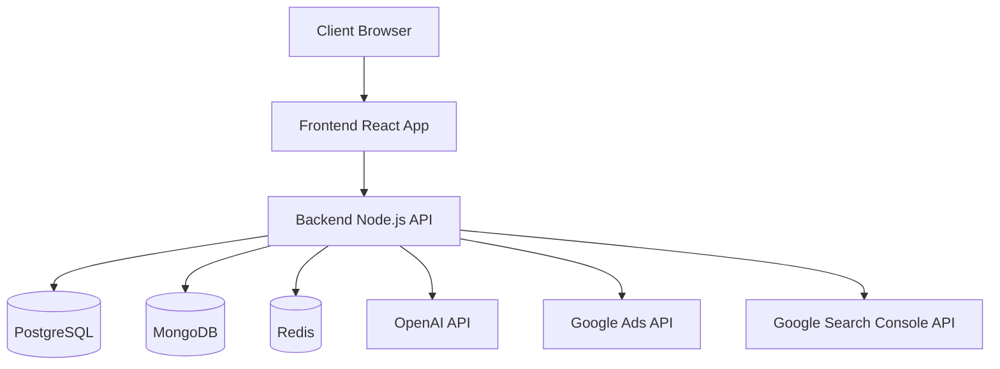

# Systeem Architectuur Overzicht
# System Architecture Overview

[Nederlands](#systeem-architectuur) | [English](#system-architecture)

## Systeem Architectuur

### 1. Systeemcomponenten

### 2. Technologie Stack

#### 2.1 Frontend
- **Framework:** React.js met TypeScript
- **UI Libraries:** Material-UI, Tailwind CSS
- **State Management:** Redux
- **Data Fetching:** GraphQL, REST
- **Testing:** Jest, Cypress

#### 2.2 Backend
- **Framework:** Node.js met Express
- **API Types:** REST + GraphQL
- **ORM:** Prisma
- **Monitoring:** New Relic
- **Logging:** Winston

#### 2.3 Databases
- **Relationeel:** PostgreSQL
  - Gebruikersdata
  - Campagne informatie
  - Facturering
- **NoSQL:** MongoDB
  - Analytics data
  - AI gegenereerde content
  - Logs
- **Caching:** Redis
  - Sessies
  - API caching
  - Rate limiting

### 3. Infrastructuur

#### 3.1 Hosting
- **Frontend:** Vercel
- **Backend:** AWS ECS
- **Databases:** AWS RDS (PostgreSQL), MongoDB Atlas
- **Caching:** AWS ElastiCache (Redis)

#### 3.2 CI/CD
- GitHub Actions voor automatische deployments
- Docker containers voor consistente omgevingen
- Terraform voor infrastructure as code

### 4. Beveiliging

#### 4.1 Authenticatie & Autorisatie
- OAuth 2.0 + JWT voor authenticatie
- Role-based access control (RBAC)
- 2FA voor extra beveiliging

#### 4.2 Data Beveiliging
- End-to-end encryptie
- Database encryptie
- Secure headers
- Rate limiting
- DDoS bescherming

### 5. Monitoring & Logging

#### 5.1 Monitoring
- New Relic voor APM
- Custom dashboards voor KPIs
- Automatische alerts

#### 5.2 Logging
- Gestructureerde logging met Winston
- Log aggregatie in MongoDB
- Audit logging voor security events

## System Architecture

[English version follows the same structure...]
