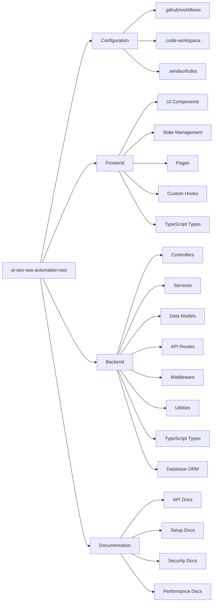

# File Structure

``` mermaid
ai-seo-sea-automation-tool/
├── .github/
│   └── workflows/
│       └── ci.yml
├── docs/
│   ├── prd.md                   # Product Requirements Document
│   ├── frontend.md              # Frontend Documentation
│   ├── backend.md               # Backend Documentation
│   ├── third-party-libraries.md # Third-Party Libraries Documentation
│   ├── devops.md                # DevOps Documentation
│   ├── testing-plan.md          # Testing Plan Documentation
│   ├── security-plan.md         # Security Plan Documentation
│   ├── user-flow.md             # User Flow Documentation
│   ├── code-documentation.md    # Code Documentation
│   ├── database-schema.md       # Database Schema Documentation
│   ├── state-management.md      # State Management Documentation
│   ├── performance-optimization.md # Performance Optimization Documentation
│   ├── api.md                   # API Documentation
├── README.md                    # Project overview and setup instructions
├── .windsurfrules              # Windsurf AI Assistant regels
├── ai-seo-sea-automation-tool.code-workspace # VS Code workspace configuratie
backend/
├── config/                  # Configuration files (e.g., database, environment variables)
├── controllers/             # Request handlers (e.g., user, campaign, content)
├── models/                  # Database models (e.g., User, Campaign, Content)
├── routes/                  # API routes (e.g., REST, GraphQL)
├── services/               # Business logic (e.g., AI processing, third-party integrations)
├── utils/                  # Utility functions (e.g., authentication, caching)
├── middleware/             # Middleware (e.g., rate limiting, input validation)
├── tests/                  # Test files (e.g., unit tests, integration tests)
├── types/                  # TypeScript type definitions
├── prisma/                 # Prisma schema en migraties
├── server.ts               # Server entry point
├── Dockerfile.dev          # Development Docker configuratie
├── .env                    # Environment variables
├── package.json            # Dependencies and scripts
├── tsconfig.json          # TypeScript configuratie
frontend/
├── public/                # Static assets (e.g., images, favicon)
├── src/
│   ├── components/        # Reusable UI components (e.g., buttons, cards)
│   ├── pages/            # Page components (e.g., Dashboard, SEO, SEA)
│   ├── styles/           # Global styles and themes
│   ├── utils/            # Utility functions (e.g., API calls, form validation)
│   ├── store/            # Redux store and slices
│   ├── hooks/            # Custom React hooks
│   ├── types/            # TypeScript type definitions
│   ├── App.tsx           # Main app component
│   ├── index.tsx         # Entry point
├── .env                  # Environment variables
├── package.json          # Dependencies and scripts
├── tsconfig.json        # TypeScript configuratie

# Project Bestandsstructuur

## Traditionele weergave
project-root/
├── .github/
│   └── workflows/
│       └── ci.yml
├── docs/
│   ├── api.md
│   ├── setup.md
│   └── ...
├── frontend/
│   ├── src/
│   │   ├── components/
│   │   ├── pages/
│   └── package.json
├── backend/
│   ├── src/
│   │   ├── controllers/
│   │   ├── models/
│   │   └── ...
│   └── package.json
└── README.md

## Mermaid Top-Down weergave
```mermaid
graph TD
    Root[ai-seo-sea-automation-tool]
    Root --> Github[.github]
    Root --> Docs[docs]
    Root --> Frontend[frontend]
    Root --> Backend[backend]
    Root --> README[README.md]
    Root --> Workspace[.code-workspace]
    Root --> Rules[.windsurfrules]
    
    Github --> Workflows[workflows]
    Workflows --> CICD[ci.yml]
    
    Docs --> PRD[prd.md]
    Docs --> FrontDoc[frontend.md]
    Docs --> BackDoc[backend.md]
    Docs --> LibDoc[third-party-libraries.md]
    Docs --> DevDoc[devops.md]
    Docs --> TestDoc[testing-plan.md]
    Docs --> SecDoc[security-plan.md]
    Docs --> FlowDoc[user-flow.md]
    Docs --> CodeDoc[code-documentation.md]
    Docs --> DBDoc[database-schema.md]
    Docs --> StateDoc[state-management.md]
    Docs --> PerfDoc[performance-optimization.md]
    Docs --> ApiDoc[api.md]
    
    Backend --> BackConfig[config]
    Backend --> BackControllers[controllers]
    Backend --> BackModels[models]
    Backend --> BackRoutes[routes]
    Backend --> BackServices[services]
    Backend --> BackUtils[utils]
    Backend --> BackMiddleware[middleware]
    Backend --> BackTests[tests]
    Backend --> BackTypes[types]
    Backend --> BackPrisma[prisma]
    Backend --> BackServer[server.ts]
    Backend --> BackDocker[Dockerfile.dev]
    Backend --> BackEnv[.env]
    Backend --> BackPackage[package.json]
    Backend --> BackTS[tsconfig.json]
    
    Frontend --> FrontPublic[public]
    Frontend --> FrontSrc[src]
    Frontend --> FrontEnv[.env]
    Frontend --> FrontPackage[package.json]
    Frontend --> FrontTS[tsconfig.json]
    
    FrontSrc --> Components[components]
    FrontSrc --> Pages[pages]
    FrontSrc --> Styles[styles]
    FrontSrc --> Utils[utils]
    FrontSrc --> Store[store]
    FrontSrc --> Hooks[hooks]
    FrontSrc --> Types[types]
    FrontSrc --> App[App.tsx]
    FrontSrc --> Index[index.tsx]
```

## Mermaid Left-Right weergave


De drie verschillende weergaves bieden elk hun eigen voordelen:

1. **Mermaid Tree View**: Geeft een complete hiërarchische weergave van alle bestanden en mappen, ideaal voor het begrijpen van de volledige structuur.

2. **Traditionele Weergave**: Een klassieke directory tree weergave die het makkelijkst te kopiëren en te volgen is voor ontwikkelaars.

3. **Mermaid Component Diagram**: Focust op de relaties tussen verschillende componenten en modules, handig voor het begrijpen van de architectuur.
