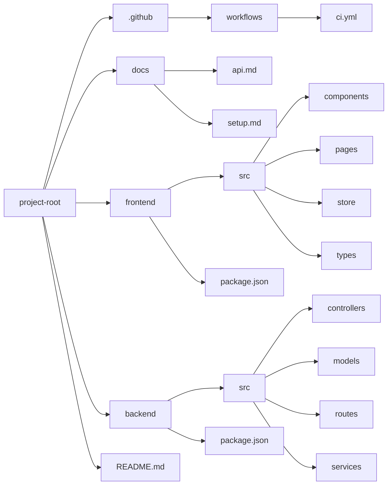

# File Structure


``` mermaid

ai-seo-sea-automation-tool/
├── docs/
│   ├── prd.md                   # Product Requirements Document
│   ├── frontend.md              # Frontend Documentation
│   ├── backend.md               # Backend Documentation
│   ├── third-party-libraries.md # Third-Party Libraries Documentation
│   ├── devops.md                # DevOps Documentation
│   ├── testing-plan.md          # Testing Plan Documentation
│   ├── security-plan.md         # Security Plan Documentation
│   ├── user-flow.md             # User Flow Documentation
│   ├── code-documentation.md    # Code Documentation
│   ├── database-schema.md       # Database Schema Documentation
│   ├── state-management.md      # State Management Documentation
│   ├── performance-optimization.md # Performance Optimization Documentation
│   ├── api.md                   # API Documentation
├── README.md                    # Project overview and setup instructions
backend/
├── config/                  # Configuration files (e.g., database, environment variables)
├── controllers/             # Request handlers (e.g., user, campaign, content)
├── models/                  # Database models (e.g., User, Campaign, Content)
├── routes/                  # API routes (e.g., REST, GraphQL)
├── services/                # Business logic (e.g., AI processing, third-party integrations)
├── utils/                   # Utility functions (e.g., authentication, caching)
├── middleware/              # Middleware (e.g., rate limiting, input validation)
├── tests/                   # Test files (e.g., unit tests, integration tests)
├── app.js                   # Main application file
├── server.js                # Server entry point
├── .env                     # Environment variables
├── package.json             # Dependencies and scripts
frontend/
├── public/                  # Static assets (e.g., images, favicon)
├── src/
│   ├── components/          # Reusable UI components (e.g., buttons, cards)
│   ├── pages/               # Page components (e.g., Dashboard, SEO, SEA)
│   ├── styles/              # Global styles and themes
│   ├── utils/               # Utility functions (e.g., API calls, form validation)
│   ├── store/               # Redux store and slices
│   ├── App.js               # Main app component
│   ├── index.js             # Entry point
├── .env                     # Environment variables
├── package.json             # Dependencies and scripts

# Project Bestandsstructuur

## Traditionele weergave
project-root/
├── .github/
│   └── workflows/
│       └── ci.yml
├── docs/
│   ├── api.md
│   ├── setup.md
│   └── ...
├── frontend/
│   ├── src/
│   │   ├── components/
│   │   ├── pages/
│   │   └── ...
│   └── package.json
├── backend/
│   ├── src/
│   │   ├── controllers/
│   │   ├── models/
│   │   └── ...
│   └── package.json
└── README.md

## Mermaid Top-Down weergave
```mermaid
graph TD
    Root[project-root] --> Github[.github]
    Root --> Docs[docs]
    Root --> Frontend[frontend]
    Root --> Backend[backend]
    Root --> README.md
    
    Github --> Workflows[workflows]
    Workflows --> CICD[ci.yml]
    
    Docs --> ApiDoc[api.md]
    Docs --> SetupDoc[setup.md]
    
    Frontend --> FrontSrc[src]
    Frontend --> FrontPackage[package.json]
    FrontSrc --> Components[components]
    FrontSrc --> Pages[pages]
    FrontSrc --> Store[store]
    FrontSrc --> Types[types]
    
    Backend --> BackSrc[src]
    Backend --> BackPackage[package.json]
    BackSrc --> Controllers[controllers]
    BackSrc --> Models[models]
    BackSrc --> Routes[routes]
    BackSrc --> Services[services]
```

## Mermaid Left-Right weergave


De Top-Down (TD) weergave is meestal het meest overzichtelijk voor bestandsstructuren omdat:
1. Het volgt de natuurlijke hiërarchische structuur
2. Het is makkelijker te lezen van boven naar beneden
3. Het neemt minder horizontale ruimte in beslag
4. Het lijkt meer op traditionele bestandsstructuur weergaves

De Left-Right (LR) weergave kan handig zijn als:
1. Je meer horizontale ruimte beschikbaar hebt
2. Je relaties tussen verschillende onderdelen wilt benadrukken
3. Je een meer flowchart-achtige weergave wilt

Voor onze documentatie gebruiken we beide weergaves omdat:
1. De traditionele weergave het makkelijkst te kopiëren is
2. De Mermaid TD-weergave het meest visueel aantrekkelijk is
3. De Mermaid LR-weergave een alternatief perspectief biedt
