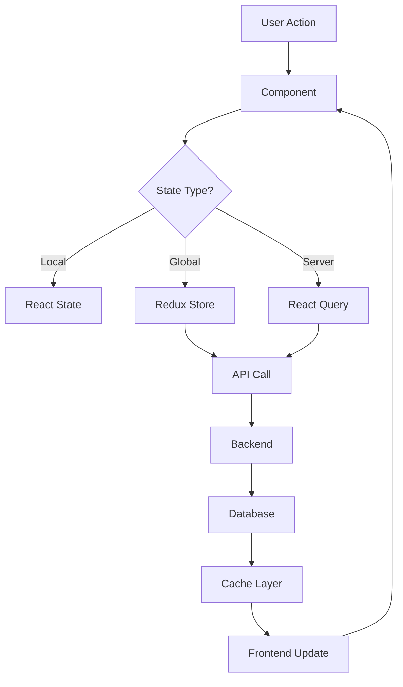

# State Management Documentation

## 1. Local State
- **React State:** Gebruik React's `useState` en `useReducer` hooks voor component-specifieke state
- **Form State:** Gebruik Formik voor form state en validatie

## 2. Global State (Redux)

### 2.1 Store Structuur
```typescript
RootState {
  analytics: {
    isLoading: boolean
    error: string | null
    dateRange: {
      start: string
      end: string
    }
    metrics: {
      pageViews: AnalyticsMetric
      uniqueVisitors: AnalyticsMetric
      bounceRate: AnalyticsMetric
      avgSessionDuration: AnalyticsMetric
    }
    trafficSources: TrafficSource[]
    topPages: {
      url: string
      views: number
      uniqueVisitors: number
    }[]
    realTimeUsers: number
  }
  auth: {
    user: User | null
    isAuthenticated: boolean
    loading: boolean
    error: string | null
  }
  seo: {
    rankings: KeywordRanking[]
    technicalIssues: TechnicalIssue[]
    backlinks: Backlink[]
    visibility: number
    loading: boolean
    error: string | null
  }
  sea: {
    campaigns: Campaign[]
    adGroups: AdGroup[]
    performance: {
      clicks: number
      impressions: number
      ctr: number
      cost: number
    }
    loading: boolean
    error: string | null
  }
}
```

### 2.2 Slices
- **analyticsSlice:** Analytics en statistieken
  - Metrics tracking
  - Traffic bronnen
  - Real-time gebruikers
- **authSlice:** Authenticatie state
  - Login/logout
  - Gebruikersgegevens
- **seoSlice:** SEO gerelateerde data
  - Keyword rankings
  - Technische issues
  - Backlinks
- **seaSlice:** SEA campagne data
  - Campagne beheer
  - Ad performance
  - Budget tracking

## 3. Server State
- **React Query:** Server-side data management
  - API responses caching
  - Automatische background updates
  - Loading/error states
- **GraphQL:** Apollo Client voor GraphQL operaties
  - Query caching
  - Optimistic updates
  - Local resolvers

## 4. Persistence 
- **Local Storage:**
  - Gebruikersvoorkeuren
  - UI instellingen
  - Auth tokens
- **Session Storage:**
  - Tijdelijke form data
  - Wizard states
  - Page state
- **Redis:**
  - API response caching
  - Rate limiting data
  - Session management

## 5. State Flow


## 6. Debugging Tools
- **Redux DevTools:**
  - Action monitoring
  - State tijdlijn
  - Action replay
- **React Query DevTools:**
  - Cache inspectie
  - Request monitoring
  - Background updates
- **React Developer Tools:**
  - Component debugging
  - Props/state inspectie
  - Performance monitoring