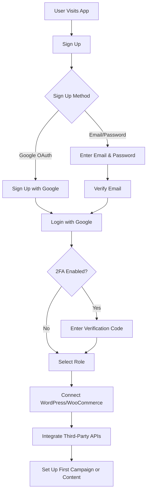
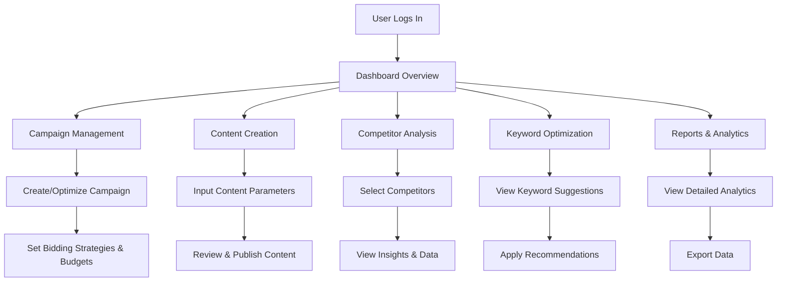
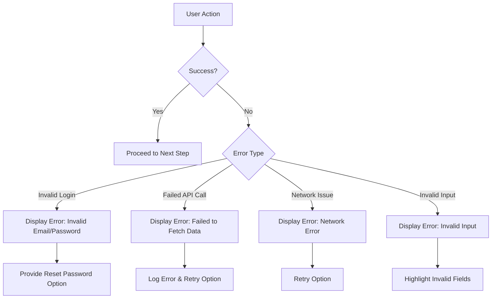
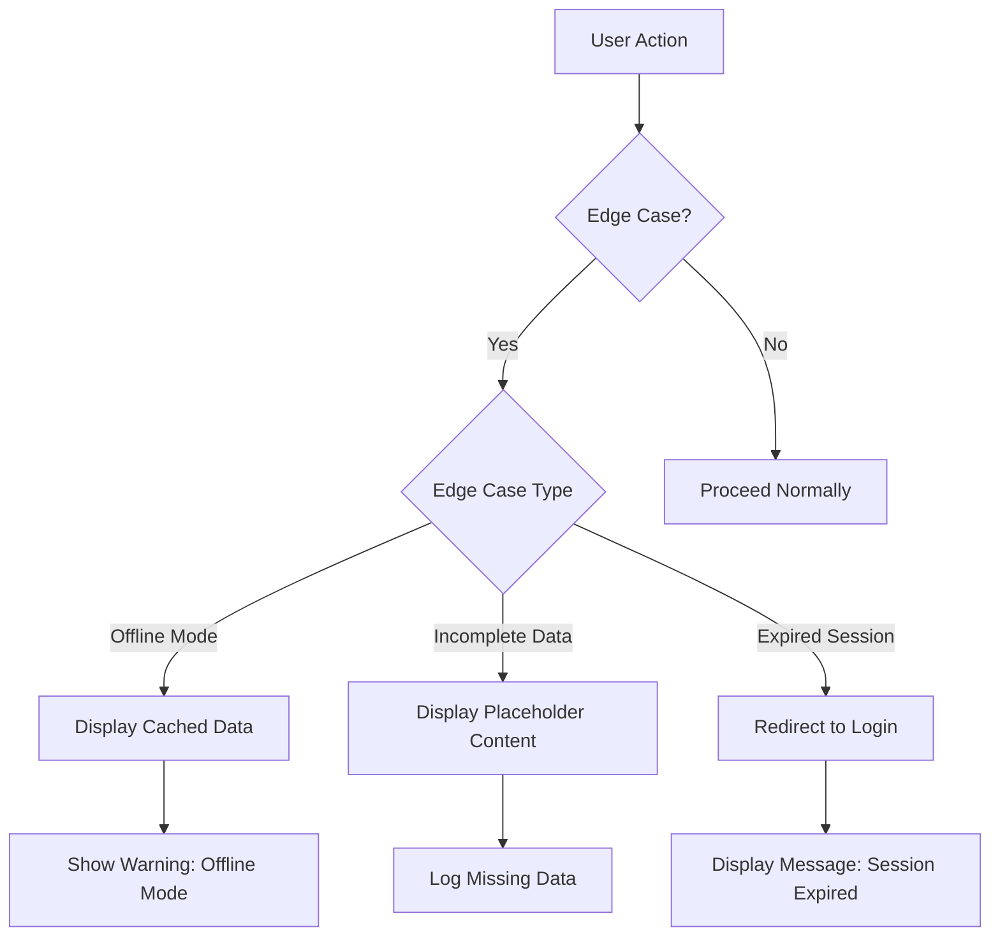
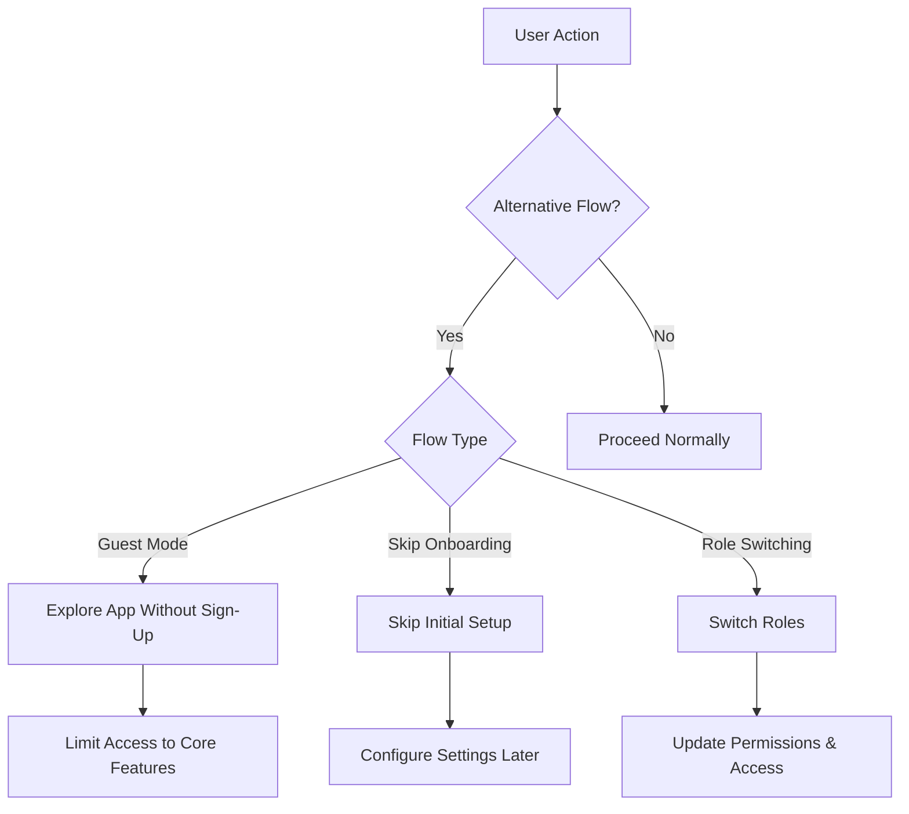
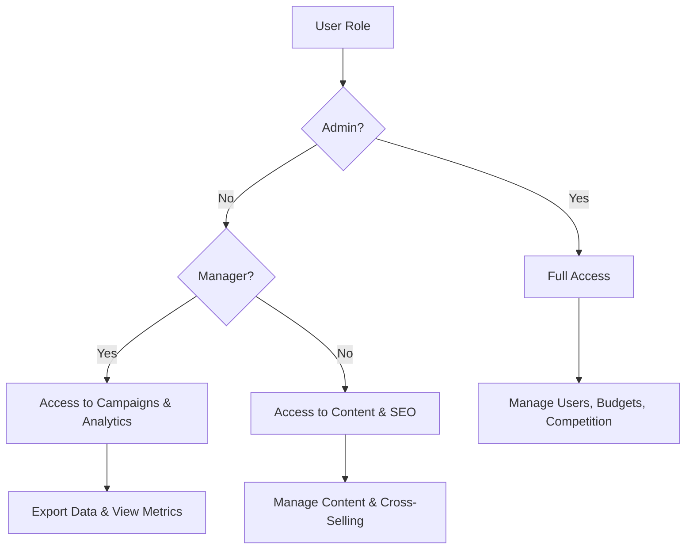
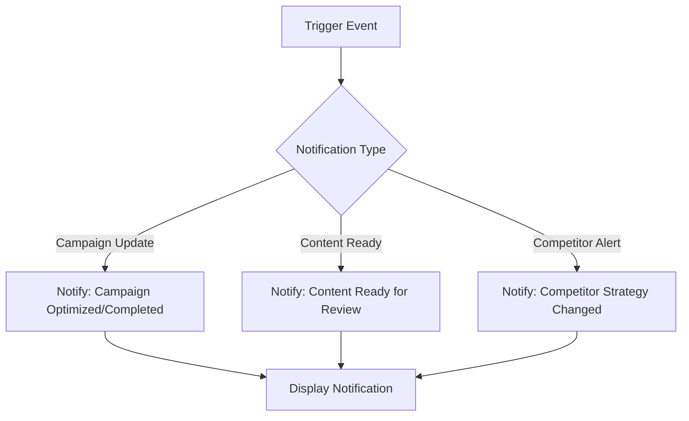

## User Flow Documentation

## 1. Onboarding Flow
### Steps:
1. **Sign-Up:**
   - User visits the app and clicks on "Sign Up."
   - User enters their email and password or signs up with Google (OAuth 2.0).
   - User verifies their email address (if required).
2. **Login:**
   - User enters their email and password or logs in with Google.
   - If 2FA is enabled, user enters the verification code sent to their email or phone.
3. **Role Selection:**
   - User selects their role (Admin, Manager, or User) based on their permissions.
4. **Initial Setup:**
   - User connects their WordPress/WooCommerce website.
   - User integrates third-party APIs (e.g., Google Ads, SEMrush, Ahrefs).
   - User sets up their first campaign or content generation parameters.

### Mermaid Diagram:

---

## 2. User Flow
- De user flow documentatie is consistent en biedt een duidelijk overzicht van de stappen die gebruikers doorlopen bij het gebruik van de applicatie.
- De onboarding flow en alternatieve stromen zijn goed gedocumenteerd.

### Steps:
1. **Dashboard Overview:**
   - User logs in and lands on the dashboard.
   - Dashboard displays key metrics (e.g., ROI, CPC, traffic) using charts and cards.
2. **Campaign Management:**
   - User navigates to the "Campaigns" section.
   - User creates a new campaign or optimizes an existing one.
   - User sets bidding strategies, budgets, and targeting options.
3. **Content Creation:**
   - User navigates to the "Content" section.
   - User inputs parameters for AI-generated content (e.g., keywords, tone, length).
   - User reviews and publishes the generated content.
4. **Competitor Analysis:**
   - User navigates to the "Competitors" section.
   - User selects competitors to analyze.
   - User views actionable insights and raw data.
5. **Keyword Optimization:**
   - User navigates to the "Keywords" section.
   - User views keyword suggestions (e.g., long-tail, negative keywords).
   - User applies keyword recommendations to campaigns or content.
6. **Reports and Analytics:**
   - User navigates to the "Reports" section.
   - User views detailed analytics and exports data.

### Mermaid Diagram:

---

## 3. Error Handling
### Scenarios:
1. **Invalid Login:**
   - Display error message: "Invalid email or password."
   - Provide option to reset password.
2. **Failed API Calls:**
   - Display error message: "Failed to fetch data. Please try again."
   - Log error for debugging.
3. **Network Issues:**
   - Display error message: "Network error. Please check your connection."
   - Provide option to retry.
4. **Invalid Input:**
   - Display error message: "Please fill out all required fields correctly."
   - Highlight invalid fields.

### Mermaid Diagram:

---

## 4. Edge Cases
### Scenarios:
1. **Offline Mode:**
   - Allow users to view cached data (e.g., recent campaigns, content).
   - Display warning: "You are offline. Some features may not be available."
2. **Incomplete Data:**
   - Display placeholder content or default values.
   - Log missing data for debugging.
3. **Expired Sessions:**
   - Redirect users to the login page.
   - Display message: "Your session has expired. Please log in again."

### Mermaid Diagram:

---

## 5. Alternative Flows
### Scenarios:
1. **Guest Mode:**
   - Allow users to explore the app without signing up.
   - Limit access to core features (e.g., view demo campaigns, content).
2. **Skip Onboarding:**
   - Allow users to skip the initial setup and configure settings later.
3. **Role Switching:**
   - Allow Admins to switch between roles (e.g., Admin → Manager → User).

### Mermaid Diagram:

---

## 6. User Permissions
### Roles:
1. **Admin:**
   - Full access to all features and data.
   - Can manage users, budgets, and competition.
2. **Manager:**
   - Access to campaigns, ads, and analytics.
   - Can export data and view performance metrics.
3. **User:**
   - Access to content creation and product optimization.
   - Can manage cross-selling and technical SEO.

### Mermaid Diagram:

---

## 7. Notifications
### Triggers:
1. **Campaign Updates:**
   - Notify users when a campaign is optimized or completed.
2. **Content Ready:**
   - Notify users when AI-generated content is ready for review.
3. **Competitor Alerts:**
   - Notify users when competitors change their strategies (e.g., new keywords, ad spend).

### Mermaid Diagram:

---